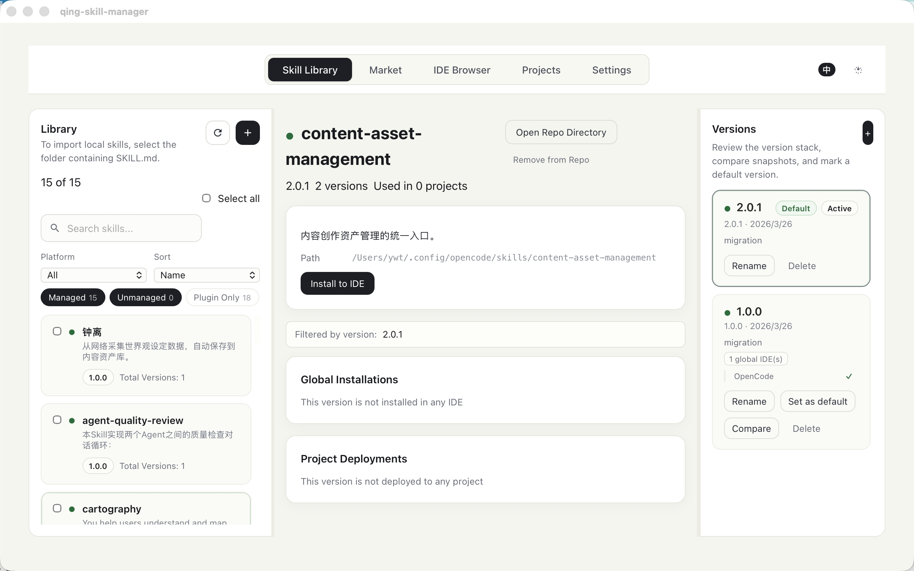
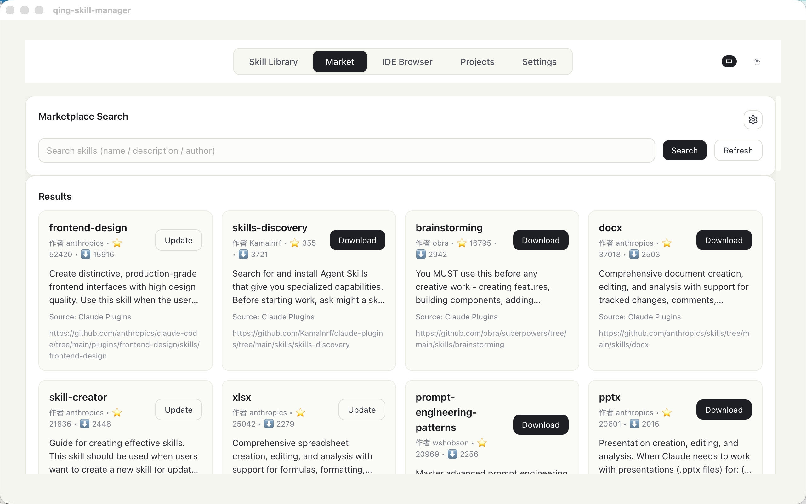
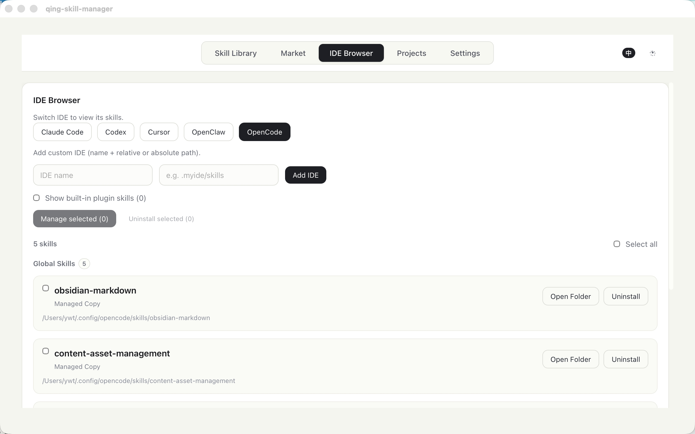
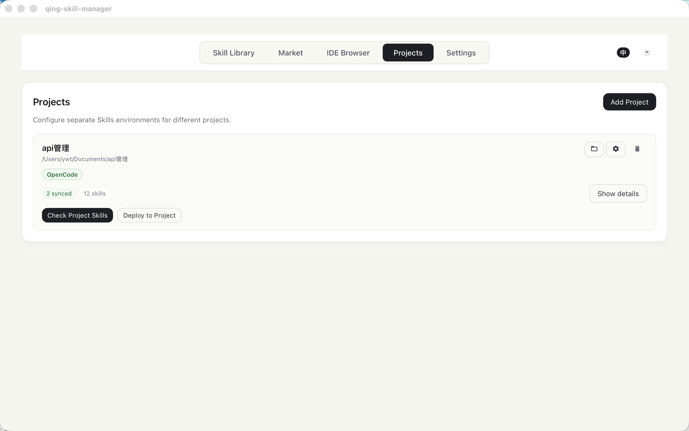

# Qing Skill Manager

[English](README.md) | [中文](README_zh-CN.md)

> Manage all the AI skills on your machine — across every project and every Agent IDE — from a single desktop app.

<p align="center">
  
</p>

As AI-powered coding agents multiply, so do the skills scattered across your device: some in Cursor, some in Claude Code, some in OpenCode, different versions in different projects. Qing Skill Manager gives you **one central place** to see everything, keep it organized, and push the right version to the right place.

Built with **Tauri 2 + Vue 3 + Rust**. Open source. Cross-platform.

## Why

- You use **multiple Agent IDEs** (Claude Code, Cursor, Codex, OpenCode, ...) and each has its own skills directory
- You work on **multiple projects**, each needing a different set (or different version) of skills
- You've lost track of which skill is where, which version is current, and what's out of date
- You want a **single source of truth** for all your AI skills on this machine

## Screenshots

| Skill Library | Marketplace |
|:---:|:---:|
|  |  |

| IDE Browser | Projects |
|:---:|:---:|
|  |  |

## Core Features

### Multi-IDE Skill Management

Every Agent IDE stores skills in its own directory. Qing Skill Manager reads them all, shows you exactly what's installed where, and lets you install, uninstall, or sync from one unified view. Natively supports **Claude Code, Cursor, Codex, OpenCode, OpenClaw** — and you can register any custom IDE in seconds.

### Multi-Version Skill Tracking

Each skill can have **multiple versions** in your local repository. Compare any two versions side-by-side (file diffs, metadata changes, similarity score). Set a default version, create named **variants** for different use cases (e.g. "concise" vs. "verbose"), and pin a specific version to a specific project. Version history tracks source (marketplace, project import, manual) and creation date.

### Skill Library with Classification

The three-column **Skill Library** is the main workspace:

- **Left sidebar** — search, filter by platform (which IDE), filter by status (Managed / Unmanaged / Plugin-Only), sort by name or version count
- **Center panel** — detailed view of the selected skill: description, path, installation status per IDE, project deployments, quick actions
- **Right version rail** — full version history, default indicator, per-version IDE and project counts, rename/delete/compare/set-default actions

Skills are classified as **Managed** (tracked in your repo), **Unmanaged** (found in an IDE but not in your repo), or **Plugin-Only**. Unmanaged skills can be "adopted" into the central repo with one click.

### Per-Project Skill Deployment

Register your projects, configure which IDEs each project uses, and deploy specific skill versions. The app **auto-detects existing skills** in project directories and flags conflicts when a project's version differs from your repo. Conflict resolution offers three choices: **keep** the project version, **overwrite** with the repo version, or **coexist** (rename and keep both).

### Marketplace Discovery

Search skills from **Claude Plugins**, **SkillsLLM**, and **SkillsMP** in one interface. Downloaded skills go straight into your local repository, ready to be installed anywhere. Updates are detected automatically.

## Supported IDEs

| IDE | Global Skills Path | Project Skills Path |
|-----|-------------------|-------------------|
| Claude Code | `~/.claude/skills` | `.claude/skills` |
| Codex | `~/.codex/skills` | `.codex/skills` |
| Cursor | `~/.cursor/skills` | `.cursor/skills` |
| OpenClaw | `~/.openclaw/skills` | `.openclaw/skills` |
| OpenCode | `~/.config/opencode/skills` | `.opencode/skills` |

**+ Any custom IDE** you register (name + skills directory path).

## How It Works

```
Marketplace / Local folder
        ↓ download / import
  Central Repository  (~/.qing-skill-manager/skills)
        ↓ install (copy)           ↓ clone (copy + version pin)
  Global IDE directories        Project IDE directories
  (available everywhere)        (scoped to one project)
```

1. **Collect** — Download from marketplaces, or import from local folders. Everything lands in the central repository.
2. **Organize** — Browse your library, manage versions, create variants, classify and filter.
3. **Distribute** — Install globally to IDEs, or clone specific versions into specific projects.
4. **Maintain** — The app tracks what's installed where. When versions diverge, it detects conflicts and guides resolution.

## Getting Started

### Prerequisites

- [Node.js](https://nodejs.org/) (LTS)
- [Rust](https://rustup.rs/)
- [pnpm](https://pnpm.io/)
- macOS: Xcode Command Line Tools

### Install & Run

```bash
git clone https://github.com/qing-claw/qing-skill-manager.git
cd qing-skill-manager/skills-manager
pnpm install
pnpm tauri dev
```

### Build

```bash
pnpm tauri build
```

### macOS Security Note

The app is not yet signed with an Apple Developer certificate. On first launch you may see "App is damaged" or "unidentified developer" warnings. Run this to bypass:

```bash
xattr -dr com.apple.quarantine "/Applications/qing-skill-manager.app"
```

## Data Sources

| Source | URL |
|--------|-----|
| Claude Plugins | `https://claude-plugins.dev/api/skills` |
| SkillsLLM | `https://skillsllm.com/api/skills` |
| SkillsMP | `https://skillsmp.com/api/v1/skills/search` (API key may be required) |

## Tech Stack

- **Desktop**: Tauri 2 (Rust backend, WebView frontend)
- **Frontend**: Vue 3 + TypeScript + Vite
- **Language**: English & Simplified Chinese (vue-i18n)

## Acknowledgement

Qing Skill Manager is built on top of the original [skills-manager](https://github.com/Rito-w/skills-manager). Thanks to the original author and all contributors.

## License

MIT
