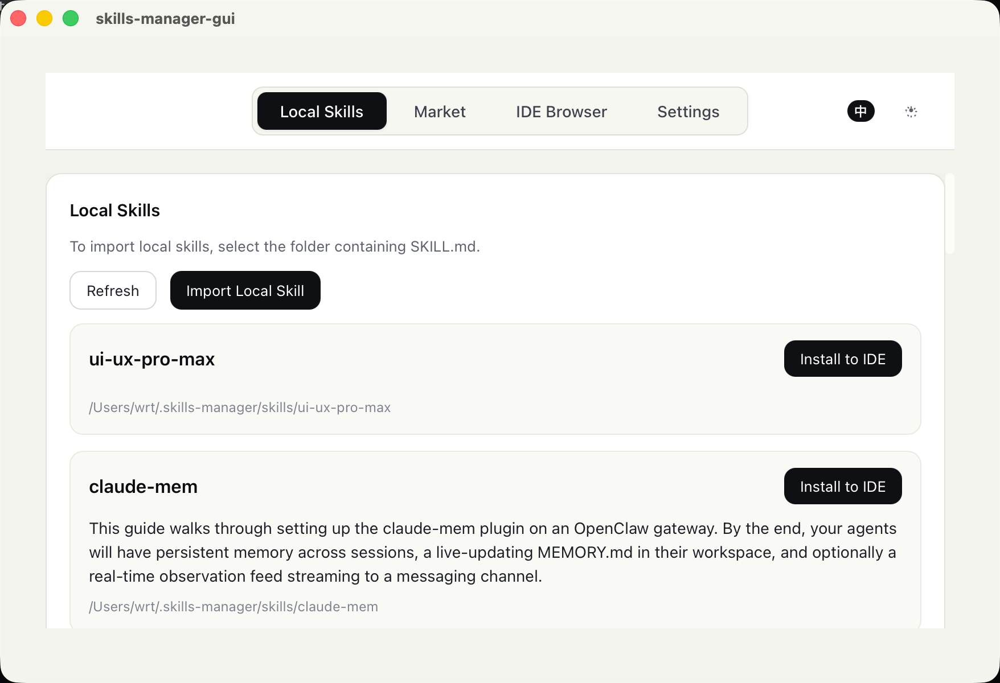
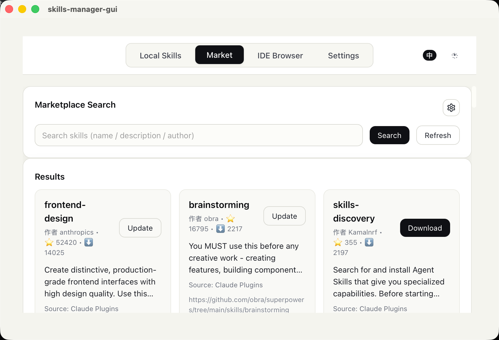
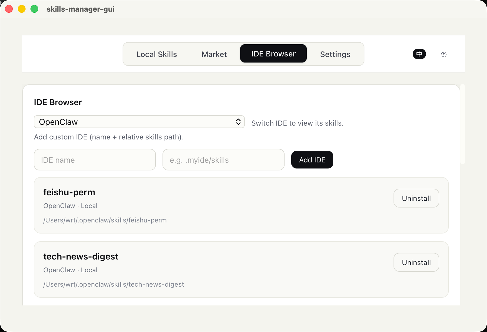

# Skills Manager

[English](README.md) | [中文](README_zh-CN.md)

**Multi-market aggregated search, one-click install to 10+ AI IDEs.** A cross-platform skills manager that lets you search skills from multiple marketplaces (Claude Plugins, SkillsLLM, SkillsMP), download to a local repository, and install to any AI-powered IDE with a single click.





## Core Features

- Remote Market Search (based on public registry)
- Download to local repository (`~/.skills-manager/skills`)
- One-click install of local skills to specified IDEs (symlink)
- IDE browsing and uninstallation (remove links or delete directories)
- Custom IDE support (Name + Directory)
- Support for updating skills if they already exist locally
- Automatic Update Check: Detects latest GitHub Release on startup

## Default Supported IDEs (Alphabetical Order)

- Antigravity: `.agent/skills`
- Claude: `.claude/skills`
- CodeBuddy: `.codebuddy/skills`
- Codex: `.codex/skills`
- Cursor: `.cursor/skills`
- Kiro: `.kiro/skills`
- Qoder: `.qoder/skills`
- Trae: `.trae/skills`
- VSCode: `.github/skills`
- Windsurf: `.windsurf/skills`

## Usage

### Installation

- Download the Release installer directly (recommended for general users)
- Pull source code and run locally (for development/customization)

### macOS Security Note

If you see "Damaged and can't be opened", you can run the following in the terminal (temporary bypass for development):

```bash
xattr -dr com.apple.quarantine "/Applications/skills-manager-gui.app"
```

### 1) Market

- Search for and download skills to the local repository
- If a skill already exists locally, an "Update" button will appear

### 2) Local Skills

- Displays skills in the local repository
- Click "Install" to select one or more IDEs for installation

### 3) IDE Browser

- Select an IDE to view its existing skills
- Supports uninstallation (removes link if linked, deletes directory if not)
- Add custom IDEs (Name + Path relative to user directory)

## Installation & Development

### Prerequisites

- Node.js (LTS recommended)
- Rust (installed via rustup)
- macOS: Xcode Command Line Tools

### Local Development

```bash
pnpm install
pnpm tauri dev
```

### Build & Release

```bash
pnpm tauri build
```


## Remote Data Sources

- **Claude Plugins**: `https://claude-plugins.dev/api/skills`
- **SkillsLLM**: `https://skillsllm.com/api/skills`
- **SkillsMP**: `https://skillsmp.com/api/v1/skills/search` (API key required)
- Download API: `https://github-zip-api.val.run/zip?source=<repo>`

## Tech Stack

- Tauri 2
- Vue 3 + TypeScript + Vite
- Rust (Backend commands)


## License

TBD
