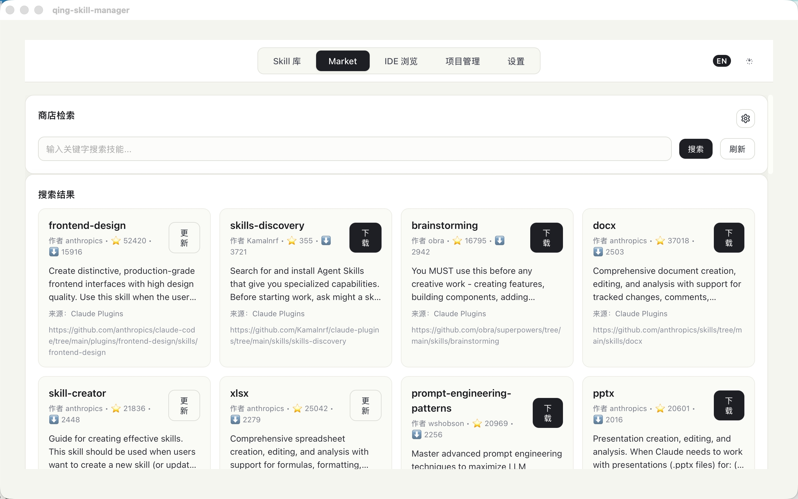
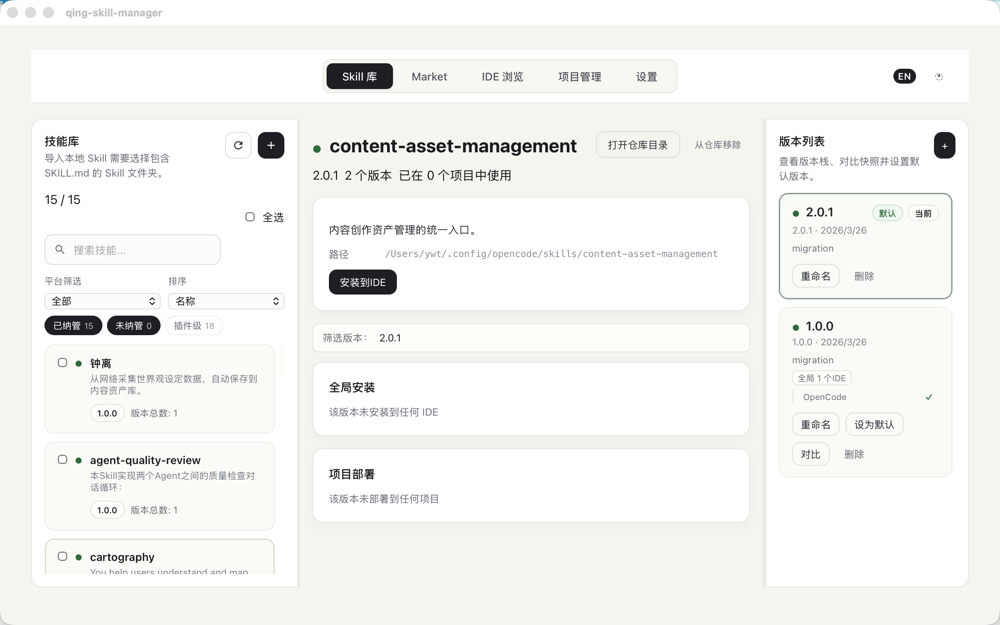
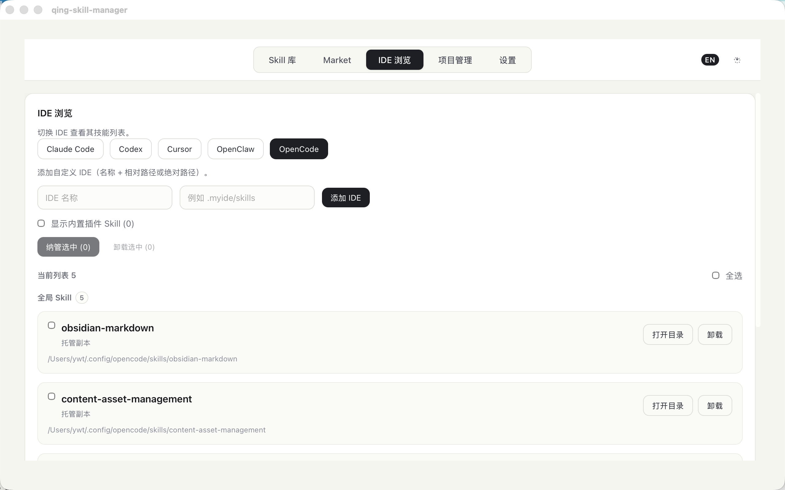
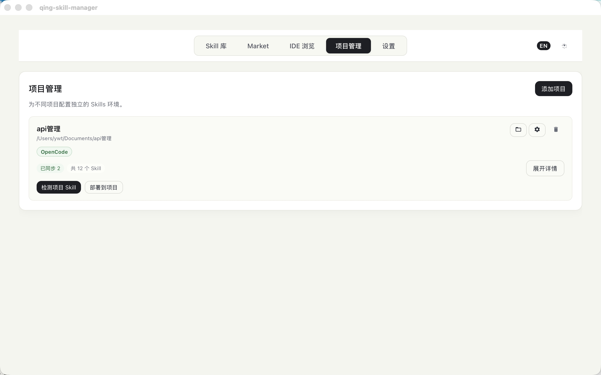

# Qing Skill Manager

[English](README.md) | [中文](README_zh-CN.md)

> 一款用于发现、管理和分发 AI Skills 到多个 IDE 与项目的桌面应用。

<p align="center">
  
</p>

Qing Skill Manager 让你在一个地方搜索公共 Skill 市场、将 Skills 存入本地仓库、一键安装到任意支持的 IDE，并将带版本控制的副本克隆到各个项目中——内建冲突检测与解决机制。

基于 **Tauri 2 + Vue 3 + Rust** 构建，跨平台桌面应用。

## 界面预览

| 本地技能库 | 商店检索 |
|:---:|:---:|
|  |  |

| IDE 浏览 | 项目管理 |
|:---:|:---:|
|  |  |

## 功能特性

### 聚合市场检索

一站式搜索多个公共 Skill 注册中心（Claude Plugins、SkillsLLM、SkillsMP）。一键下载新 Skill 或更新已有版本。

### 统一本地仓库

所有下载的 Skills 集中存储在 `~/.qing-skill-manager/skills`。在"已有 Skills"标签页中浏览、搜索、筛选和管理你的全部技能。

### 一键安装到 IDE

将任意本地 Skill 同时安装到一个或多个 IDE。支持全局安装（所有项目可用）和项目级克隆（仅限特定项目）。

### IDE 维度浏览

切换不同 IDE 查看各自的安装情况。安全卸载，或将手动放置的未托管 Skill 纳入中央仓库统一管理。

### 项目管理

注册你的项目、配置每个项目使用的 IDE、直接部署 Skills。应用会自动检测项目中已有的 Skills，并在版本不一致时提供清晰的冲突解决方案（保留、覆盖或共存）。

### 版本管理

以 Git 风格跟踪每个 Skill 的多个版本。支持版本对比、设置默认版本、为不同场景创建变体，以及为特定项目锁定指定版本。

### 自定义 IDE 支持

找不到你的 IDE？只需指定名称和 Skills 目录路径即可添加自定义 IDE，功能与内置 IDE 完全一致。

## 支持的 IDE

| IDE | 全局路径 | 项目路径 |
|-----|---------|---------|
| Claude Code | `~/.claude/skills` | `.claude/skills` |
| Codex | `~/.codex/skills` | `.codex/skills` |
| Cursor | `~/.cursor/skills` | `.cursor/skills` |
| OpenClaw | `~/.openclaw/skills` | `.openclaw/skills` |
| OpenCode | `~/.config/opencode/skills` | `.opencode/skills` |

还可以注册任意自定义 IDE。

## 快速开始

### 环境要求

- [Node.js](https://nodejs.org/) (LTS 版本)
- [Rust](https://rustup.rs/)
- [pnpm](https://pnpm.io/)
- macOS: Xcode Command Line Tools

### 安装与运行

```bash
git clone <your-fork-url>
cd skills-manager
pnpm install
pnpm tauri dev
```

### 构建

```bash
pnpm tauri build
```

### macOS 安全提示

应用尚未配置 Apple 开发者签名。首次启动可能会提示"应用已损坏"或"来自身份不明的开发者"。执行以下命令即可放行：

```bash
xattr -dr com.apple.quarantine "/Applications/qing-skill-manager.app"
```

## 典型工作流

1. **搜索** — 进入 Market 标签页，搜索 Skill，点击下载
2. **浏览** — 切换到"已有 Skills"查看已下载的技能
3. **安装** — 点击"安装到 IDE"，选择目标 IDE
4. **项目部署** — 在"项目管理"中添加项目、配置 IDE 目标，然后关联 Skills
5. **保持同步** — 当项目中的 Skill 与仓库版本不一致时，应用会自动检测冲突并引导你完成解决

## 数据来源

| 来源 | 地址 |
|------|------|
| Claude Plugins | `https://claude-plugins.dev/api/skills` |
| SkillsLLM | `https://skillsllm.com/api/skills` |
| SkillsMP | `https://skillsmp.com/api/v1/skills/search`（可能需要配置 API Key） |

## 技术栈

- **桌面端**: Tauri 2（Rust 后端 + WebView 前端）
- **前端**: Vue 3 + TypeScript + Vite
- **多语言**: 中文 & English（vue-i18n）

## 致谢

Qing Skill Manager 基于 [skills-manager](https://github.com/Rito-w/skills-manager) 原始项目继续开发。感谢原作者与所有贡献者。

## 许可证

MIT
